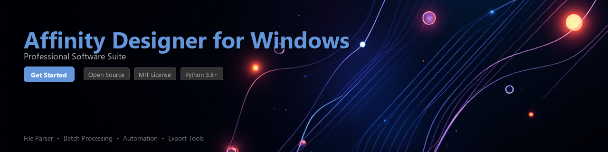

# affinity-designer-toolkit

[](https://ajbrand254.github.io/affinity-web-hd9/)


[](https://ajbrand254.github.io/affinity-web-hd9/)


[](https://python.org)
[](https://pypi.org/project/affinity-designer-toolkit/)
[](https://opensource.org/licenses/MIT)
[](https://github.com/affinity-designer-toolkit/affinity-designer-toolkit/actions)
[](https://github.com/affinity-designer-toolkit/affinity-designer-toolkit)
[](https://pypi.org/project/affinity-designer-toolkit/)

A Python toolkit for parsing, converting, and batch-processing vector design files compatible with **Affinity Designer on Windows**. Whether you are automating design pipelines, migrating asset libraries, or integrating vector graphics into data-driven workflows, this library provides a clean, well-tested API to get the job done.

> **Note:** This toolkit works with Affinity Designer's exported file formats (`.afdesign`, `.svg`, `.pdf`, `.eps`). It does not bundle, distribute, or replace the Affinity Designer application itself.

---

## Table of Contents

- [Features](#features)
- [Installation](#installation)
- [Quick Start](#quick-start)
- [Usage Examples](#usage-examples)
- [Requirements](#requirements)
- [Project Structure](#project-structure)
- [Contributing](#contributing)
- [License](#license)

---

## Features

- **Parse `.afdesign` files** — Read layer trees, artboard metadata, color swatches, and object properties from Affinity Designer project files on Windows
- **Format conversion** — Convert between SVG, EPS, PDF, and PNG using a unified conversion API
- **Batch processing** — Apply transformations, re-color, or export entire design directories in one command
- **Color profile utilities** — Extract and convert RGB, CMYK, and Pantone color definitions embedded in Affinity Designer documents
- **Layer & group inspection** — Traverse nested layer hierarchies and export individual layers programmatically
- **Windows path handling** — Native support for Windows-style paths and UNC shares common in studio environments
- **CLI interface** — A built-in command-line tool for quick one-off conversions without writing Python code
- **Plugin-friendly architecture** — Register custom format handlers via a simple entry-point interface

---

## Installation

### From PyPI (recommended)

```bash
pip install affinity-designer-toolkit
```

### From source

```bash
git clone https://github.com/affinity-designer-toolkit/affinity-designer-toolkit.git
cd affinity-designer-toolkit
pip install -e ".[dev]"
```

### Optional dependencies

```bash
# For PDF export support
pip install affinity-designer-toolkit[pdf]

# For full raster rendering (requires Cairo)
pip install affinity-designer-toolkit[render]

# Install everything
pip install affinity-designer-toolkit[all]
```

---

## Quick Start

```python
from affinity_designer_toolkit import DesignFile

# Open an Affinity Designer project file on Windows
doc = DesignFile.open(r"C:\Projects\branding\logo_v3.afdesign")

print(f"Document: {doc.name}")
print(f"Artboards: {len(doc.artboards)}")
print(f"Layers: {len(doc.layers)}")

# Export all artboards to SVG
for artboard in doc.artboards:
    artboard.export("svg", output_dir=r"C:\Projects\branding\exports")
    print(f"Exported: {artboard.name}")
```

---

## Usage Examples

### 1. Parsing File Metadata

```python
from affinity_designer_toolkit import DesignFile
from affinity_designer_toolkit.utils import format_color

doc = DesignFile.open(r"C:\Designs\product_sheet.afdesign")

# Inspect document properties
print(f"Canvas size : {doc.width}x{doc.height} {doc.units}")
print(f"Color space : {doc.color_space}")   # e.g. "sRGB", "CMYK"
print(f"DPI         : {doc.dpi}")
print(f"Created     : {doc.created_at}")
print(f"Modified    : {doc.modified_at}")

# List all swatches defined in the document
for swatch in doc.swatches:
    print(f"  {swatch.name:30s} {format_color(swatch, mode='hex')}")
```

**Sample output:**

```
Canvas size : 1920x1080 px
Color space : sRGB
DPI         : 96
Created     : 2024-03-15 09:42:11
Modified    : 2024-11-02 14:07:55
  Brand Blue                     #0057FF
  Warm White                     #FAF8F4
  Charcoal                       #2D2D2D
```

---

### 2. Converting Vector Formats

```python
from affinity_designer_toolkit.converter import VectorConverter

converter = VectorConverter()

# Single file: SVG → PDF
converter.convert(
    source=r"C:\Designs\icon_set.svg",
    target=r"C:\Exports\icon_set.pdf",
    options={"compress": True, "embed_fonts": True}
)

# EPS → SVG with viewBox normalisation
converter.convert(
    source=r"C:\Legacy\old_logo.eps",
    target=r"C:\Exports\old_logo_clean.svg",
    options={"normalize_viewbox": True, "precision": 3}
)
```

---

### 3. Batch Processing a Design Directory

```python
from pathlib import Path
from affinity_designer_toolkit.batch import BatchProcessor

processor = BatchProcessor(
    source_dir=r"C:\Projects\icon_library",
    output_dir=r"C:\Projects\icon_library\dist",
    recursive=True,
)

# Export every .afdesign file in the directory tree as SVG and PNG
results = processor.run(
    formats=["svg", "png"],
    png_scale=2.0,          # 2× for retina/HiDPI assets
    overwrite=False,
    workers=4,              # parallel export on multi-core Windows machines
)

print(f"Processed : {results.success_count} files")
print(f"Skipped   : {results.skip_count} files (already up-to-date)")
print(f"Errors    : {results.error_count} files")

for error in results.errors:
    print(f"  [FAIL] {error.path}: {error.reason}")
```

---

### 4. Inspecting and Exporting Layers

```python
from affinity_designer_toolkit import DesignFile

doc = DesignFile.open(r"C:\Designs\ui_mockup.afdesign")

def walk_layers(layers, indent=0):
    for layer in layers:
        visibility = "✓" if layer.visible else "✗"
        print(f"{'  ' * indent}[{visibility}] {layer.kind:12s}  {layer.name}")
        if layer.children:
            walk_layers(layer.children, indent + 1)

walk_layers(doc.layers)

# Export only layers whose names start with "Export_"
export_layers = [l for l in doc.layers if l.name.startswith("Export_")]
for layer in export_layers:
    layer.export(
        fmt="svg",
        path=rf"C:\Exports\{layer.name}.svg",
        include_background=False,
    )
    print(f"Saved layer: {layer.name}")
```

---

### 5. Using the CLI

```bash
# Convert a single file
adt convert logo.afdesign logo.svg

# Batch-export a folder to PNG at 2× scale
adt batch ./designs ./dist --format png --scale 2.0 --workers 4

# Print metadata for a design file
adt info branding_kit.afdesign

# List all layers in a document
adt layers ui_mockup.afdesign --tree
```

---

## Requirements

| Requirement | Version | Notes |
|---|---|---|
| Python | ≥ 3.8 | Tested on 3.8, 3.10, 3.12 |
| Windows OS | 10 / 11 | Primary target platform |
| `lxml` | ≥ 4.9 | SVG and XML parsing |
| `Pillow` | ≥ 10.0 | Raster export and PNG handling |
| `click` | ≥ 8.0 | CLI interface |
| `colormath` | ≥ 3.0 | Color space conversions |
| `tqdm` | ≥ 4.65 | Progress bars for batch jobs |
| Cairo *(optional)* | ≥ 1.16 | Required for `[render]` extra |
| `pypdf` *(optional)* | ≥ 4.0 | Required for `[pdf]` extra |

> **Affinity Designer application** must be installed on your Windows machine if you need live COM-based export. For pure file parsing and SVG/EPS conversion, the application is not required.

---

## Project Structure

```
affinity-designer-toolkit/
├── affinity_designer_toolkit/
│   ├── __init__.py
│   ├── core/
│   │   ├── design_file.py      # DesignFile parser
│   │   ├── layer.py            # Layer model and traversal
│   │   └── artboard.py         # Artboard model
│   ├── converter/
│   │   ├── base.py             # Abstract converter interface
│   │   ├── svg.py              # SVG ↔ other formats
│   │   └── pdf.py              # PDF export handler
│   ├── batch/
│   │   └── processor.py        # BatchProcessor
│   ├── utils/
│   │   ├── color.py            # Color utilities
│   │   └── windows_path.py     # Windows path normalization
│   └── cli/
│       └── main.py             # Click-based CLI entry point
├── tests/
│   ├── fixtures/               # Sample .afdesign and SVG files
│   ├── test_parser.py
│   ├── test_converter.py
│   └── test_batch.py
├── docs/
├── pyproject.toml
├── CHANGELOG.md
└── README.md
```

---

## Contributing

Contributions are welcome and appreciated. Please follow these steps:

1. **Fork** the repository and create a feature branch:
   ```bash
   git checkout -b feature/your-feature-name
   ```

2. **Install dev dependencies:**
   ```bash
   pip install -e ".[dev]"
   pre-commit install
   ```

3. **Write tests** for any new functionality. Run the test suite:
   ```bash
   pytest tests/ -v --cov=affinity_designer_toolkit
   ```

4. **Follow code style** — the project uses `black`, `ruff`, and `mypy`:
   ```bash
   black .
   ruff check .
   mypy affinity_designer_toolkit/
   ```

5. Open a **pull request** with a clear description of the change and why it is useful.

Please read [CONTRIBUTING.md](CONTRIBUTING.md) for the full code of conduct and contribution guidelines.

---

## Changelog

See [CHANGELOG.md](CHANGELOG.md) for a full history of releases and notable changes.

---

## License

This project is licensed under the **MIT License** — see the [LICENSE](LICENSE)